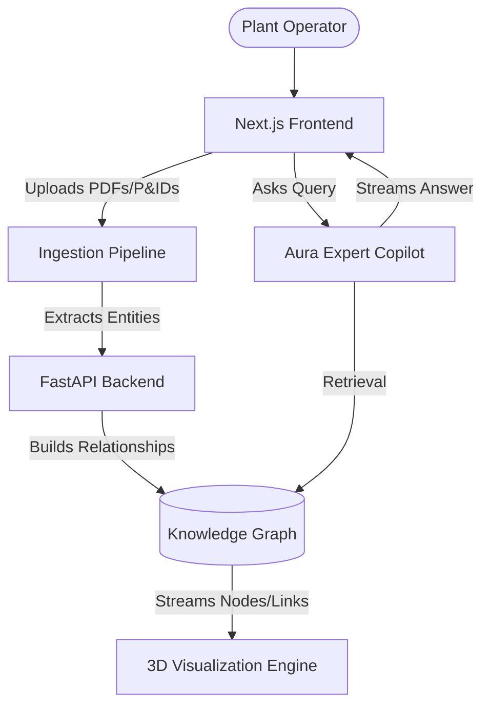

# 🧠 Aura | Industrial Brain

<div align="center">
  <p><strong>An advanced AI-powered Industrial Knowledge Copilot and 3D Asset Intelligence Platform</strong></p>
</div>

---

## 📖 Overview

In heavy asset industries (manufacturing, energy, chemicals), critical knowledge is often trapped in fragmented silos: legacy P&ID schematics, dense OEM PDF manuals, and disconnected maintenance work orders. 

**Aura (The Industrial Brain)** is a unified platform that solves this by serving as an intelligent, multimodal "Copilot" for plant engineers and operators. It instantly ingests complex documents, constructs a dynamic **3D Knowledge Graph** of the plant's ontology, and provides a conversational RAG (Retrieval-Augmented Generation) interface to diagnose anomalies, explain schematics, and recommend maintenance actions.

## ✨ Key Features

- 📄 **Multimodal Document Ingestion:** Drag-and-drop ingestion of P&ID diagrams, equipment manuals, and structured CSV work orders. Built to seamlessly integrate with models like Gemini 1.5 Pro to extract structured entities.
- 🌐 **Interactive 3D Knowledge Graph:** A high-performance 3D physics engine that visualizes the complex web of relationships between physical equipment (e.g., pumps, motors), technical documents, and live alerts. Nodes feature floating text labels and dynamic glow effects.
- 🤖 **Expert Copilot (RAG Chat):** An intelligent AI assistant that answers questions grounded strictly in the ingested plant data. It can explain uploaded schematics (e.g., *"What is the flow path of Pump-101?"*) and provide step-by-step Root Cause Analyses for equipment anomalies.
- 🎨 **Premium "Futuristic Industrial" UI:** A sleek, dark-mode interface featuring glassmorphism, smooth Framer Motion animations, particle backgrounds, and a highly responsive layout.

## 🏗️ System Architecture



## 🚀 Tech Stack

### Frontend
- **Framework:** Next.js 15 (App Router), React 19
- **Styling:** Tailwind CSS v4
- **Animations:** Framer Motion
- **3D Engine:** `react-force-graph-3d`, Three.js, `three-spritetext`
- **Icons:** Lucide React

### Backend
- **Framework:** Python, FastAPI, Uvicorn
- **Data Models:** Pydantic

## 🛠️ Getting Started

### 1. Run the FastAPI Backend
```bash
cd backend
python -m venv venv
# Windows: venv\Scripts\activate | Mac/Linux: source venv/bin/activate
pip install fastapi uvicorn pydantic
uvicorn main:app --reload --port 8000
```

### 2. Run the Next.js Frontend
```bash
cd frontend
npm install
npm run dev
```

### 3. Usage Guide
1. Navigate to `http://localhost:3000`.
2. Go to the **Ingestion** tab and upload the files located in the `sample_data/` folder to populate the system.
3. Open the **3D Knowledge Graph** tab to explore the generated equipment ontology.
4. Open the **Expert Copilot** and ask Aura to analyze anomalies or explain the sample P&ID schematics.

---
*Built to demonstrate the future of asset-intensive plant operations.*
